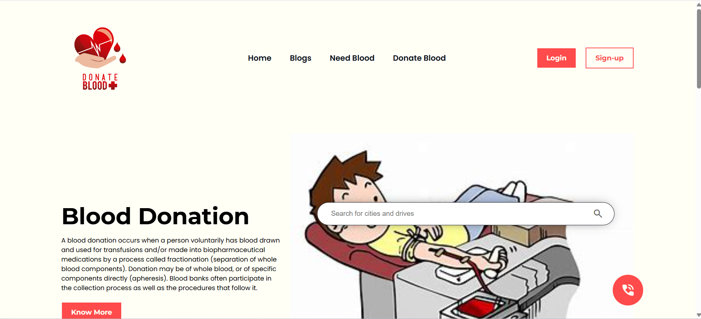

# Blood-Donation
Here’s a **detailed and well-structured README** for your **Blood Donation Website** project on GitHub. It includes **branches, sub-branches, emojis**, and a proper explanation of every section.  

---

# 🩸 Blood Donation Website - Save Lives with a Click  

## 📌 Introduction  

The **Blood Donation Website** is a platform that connects **blood donors** with **recipients** efficiently. It allows users to **find blood donors**, **request blood**, and **participate in donation camps**. The platform also educates people about the **importance of blood donation** and provides real-time updates on donation drives.  

🚀 **Goal**: To create an easy-to-use, modern, and efficient system for blood donation.  

## 🌟 Live Screenshot  

  

---

## 🌟 Features & Modules  

### 🏠 **Home Page**  
✔ Beautiful landing page with an engaging UI  
✔ Quick access to blood donation information  
✔ Call-to-action buttons for donation & requests  

### 🔍 **Search & Request Blood**  
✔ Search for donors based on location & blood group  
✔ Submit a **blood request form**  
✔ Receive notifications when a donor is available  

### ❤️ **Donate Blood**  
✔ Register as a donor  
✔ Update availability status  
✔ View nearby donation camps  

### 🏥 **Blood Banks & Donation Camps**  
✔ View a list of **blood banks**  
✔ Find nearby **donation camps**  
✔ Participate in organized blood donation events  

### 📄 **Educational Blogs & FAQs**  
✔ Informative blogs on **blood donation benefits**  
✔ FAQs addressing **common myths** about blood donation  

### 🛡 **User Authentication & Dashboard**  
✔ Secure **Login/Sign-up system**  
✔ User **Dashboard** to track donation history  
✔ **Admin Panel** for managing users and requests  

---

## 🏗 **Project Structure**  

📂 **Blood-Donation-Website**  
├── 📁 `public/` → Static assets (images, icons)  
├── 📁 `src/` → Main source code  
│   ├── 📁 `css/` → Styling files    
│   ├── 📁 `pages/` → Different website pages  
│   ├── 📄 `index.html` → Homepage  
│   ├── 📄 `donate.html` → Blood donation page  
│   ├── 📄 `request.html` → Blood request page  
│   ├── 📄 `about.html` → About blood donation  
│   ├── 📄 `contact.html` → Contact & Support  
│   └── 📄 `login.html` → User authentication  

---


---

## 🔥 **Technologies Used**  

🔹 **HTML5** - Structuring the content  
🔹 **CSS3 & Bootstrap** - For styling and responsiveness  
  
 

---

## 🎯 **Branches & Sub-Branches**  

| 🔖 Branch | 📌 Description |  
|-----------|--------------|  
| `main` | 🚀 Stable release branch (Production) |  
| `dev` | 🛠 Development branch for testing features |  
| `feature-auth` | 🔑 Handles user authentication (Login/Sign-up) |  
| `feature-request` | 📢 Manages blood request system |  
| `feature-donation` | 🩸 Manages donor registration & updates |  
| `feature-dashboard` | 📊 User & Admin dashboard functionalities |  
| `feature-ui` | 🎨 Enhancing UI/UX design |  
| `bug-fixes` | 🐞 Fixes issues and bugs reported in testing |  

---

## 🚀 **Installation & Setup**  

1️⃣ **Clone the Repository**  
```sh
git clone https://varnwal-rajan-960.github.io/Blood-Donation/
```  

2️⃣ **Navigate to the Project Directory**  
```sh
cd blood-donation
```  

3️⃣ **Open `index.html` in Your Browser**  

💡 If using a server: Run with **Live Server** in VS Code or deploy on **Github**.  

---

## 🤝 **Contributing to the Project**  

🚀 Want to improve this project? Follow these steps:  

1. **Fork the repository**  
2. **Create a new branch**  
   ```sh
   git checkout -b feature-new-feature
   ```
3. **Make your changes & commit**  
   ```sh
   git commit -m "Added new feature"
   ```
4. **Push to GitHub**  
   ```sh
   git push origin feature-new-feature
   ```
5. **Create a Pull Request**  

---

## 🛡 **License**  

📜 This project is open-source and available under the **Rajan kumar Varnwal**.  

---


---

### 🚀 **Save a Life Today! Be a Donor. 🩸**  

---

This **detailed README** ensures that anyone visiting your **GitHub repository** understands your **Blood Donation Website** completely. 🎯 Let me know if you need modifications! 🚀